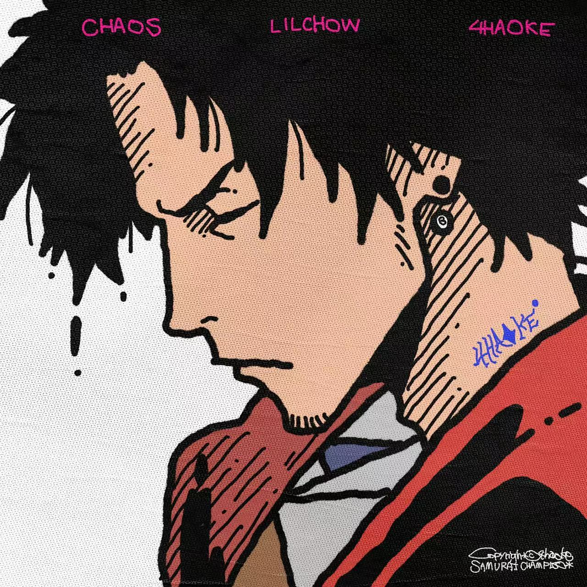

# 赛博朋克风格个人主页 (Cyberpunk Personal Homepage)

[中文](./README_CN.md) | [English](./README.md)

这是一个充满未来感、致敬《赛博朋克 2077》风格的个人主页，旨在以独特的视觉风格展示个人作品集。本项目包含霓虹美学、故障艺术效果 (Glitch) 以及多种交互元素，生动呈现“网络骇客 (Netrunner)”的氛围。


*(注：此处暂用头像作为占位符，建议替换为网页截图)*

## ✨ 特性

- **赛博朋克美学**: 沉浸式设计，包含扫描线、噪点纹理和霓虹配色（青色/粉色）。
- **故障艺术效果**: 文本和图像的 CSS 故障动画。
- **黑客文字特效**: 鼠标悬停时触发的 JavaScript 随机字符解密效果。
- **响应式设计**: 完美适配移动端和桌面端屏幕。
- **流畅导航**: 支持平滑滚动和当前导航项高亮。

## 🛠️ 技术栈

- **HTML5**: 语义化结构。
- **CSS3**: 自定义属性 (Variables)、Flexbox、Grid 布局及关键帧动画。
- **JavaScript (原生)**: DOM 操作、事件处理及视觉特效逻辑。
- **字体**: Google Fonts (Orbitron, Rajdhani, Share Tech Mono)。
- **图标**: Font Awesome。

## 🚀 快速开始

### 前置要求

您只需要一个现代网页浏览器（Chrome, Firefox, Safari, Edge）即可预览本项目。

### 安装与运行

1. 克隆仓库：
   ```bash
   git clone https://github.com/yourusername/cyberpunk-homepage.git
   ```
2. 进入项目目录：
   ```bash
   cd cyberpunk-homepage
   ```
3. 在浏览器中打开 `index.html`：
   - macOS: `open index.html`
   - Windows: `start index.html`
   - 或者直接将文件拖入浏览器标签页。

## 📂 项目结构

```
cyberpunk-homepage/
├── index.html      # 主 HTML 文件
├── style.css       # 样式与动画定义
├── script.js       # 交互逻辑与特效
├── avatar.jpg      # 个人头像
├── README.md       # 英文文档
└── README_CN.md    # 中文文档
```

## 🎨 个性化定制

- **颜色**: 修改 `style.css` 中的 `:root` 变量即可调整霓虹配色方案。
- **内容**: 编辑 `index.html` 替换为您自己的简介、技能和项目详情。
- **图片**: 将 `avatar.jpg` 替换为您的个人照片。

## 📄 许可证

本项目开源并遵循 [MIT 许可证](LICENSE)。

---

*Wake up, Samurai. We have a website to build.*
